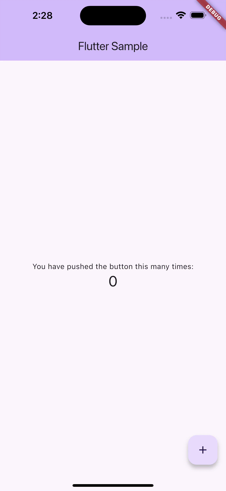

# flutter-boilerplate



## Getting started

아래 명령어를 수행해주세요!

```
$ git clone https://github.com/nogal2/flutter-sample.git
$ cd flutter-sample
$ flutter pub get
$ dart pub run melos bs
$ cd packages/flutter_sample
$ flutter run -d chrome
```

### Principles

- [Domain Driven Design](https://en.wikipedia.org/wiki/Domain-driven_design)
- [SOLID Principles](https://en.wikipedia.org/wiki/SOLID)
- [Monorepo](https://en.wikipedia.org/wiki/Monorepo)
- [MVPVM, Architectural Pattern](https://learn.microsoft.com/en-us/archive/msdn-magazine/2011/december/mvpvm-design-pattern-the-model-view-presenter-viewmodel-design-pattern-for-wpf)
- [Repository Pattern](<https://learn.microsoft.com/en-us/previous-versions/msp-n-p/ff649690(v=pandp.10)>)
- [Use Case Pattern](https://developer.android.com/topic/architecture/domain-layer)
- [Clean Architecture](https://blog.cleancoder.com/uncle-bob/2012/08/13/the-clean-architecture.html)
- [Onion Architecture](https://jeffreypalermo.com/2008/07/the-onion-architecture-part-1/)
- [Github Flow](https://docs.github.com/en/get-started/using-github/github-flow)

### State Management

- [Riverpod](https://riverpod.dev/ko/)

### Dependency Packages

- [Freezed](https://pub.dev/packages/freezed)
- [Functional Widget](https://pub.dev/packages/functional_widget)

### Dev Dependency Packages

- [Build Runner](https://pub.dev/packages/build_runner)
- [Melos](https://pub.dev/packages/melos)
